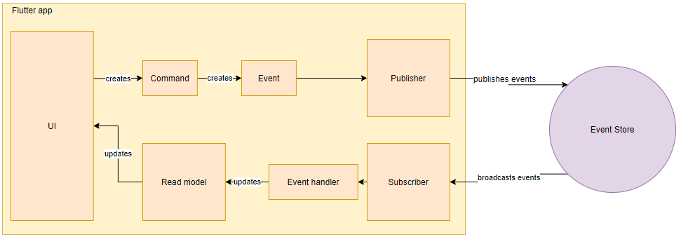

# Project TMK Example
> Example app for flutter using the event store provided for the project

## Explanation

This is a simple unauthenticated chat application which builds it state using readmodels. It supports live updates by having event handlers update the readmodels while connected to the event store.

It automatically reconnects when connection should be dropped, although this has not thoroughly been tested yet.

It executes commands in the state for ui components, and sends the created event to the event store through the event publisher.

Eventhandlers can be registered in the frontend and execute their own logic. They are supplied the event that was received. This is the mechanism that allows for live updates to UI.

This example uses readmodels, which will rebuild the state of the application everytime from the events that are received. It allows the application to work without a database. Further improvements are:
- local database to store state
- wait for events to be processed before app can be used

These improvements would only be required once the application would have to handle a considerable amount of events, which is why they are not implemented here.

This image should visualise the flow of application state.

